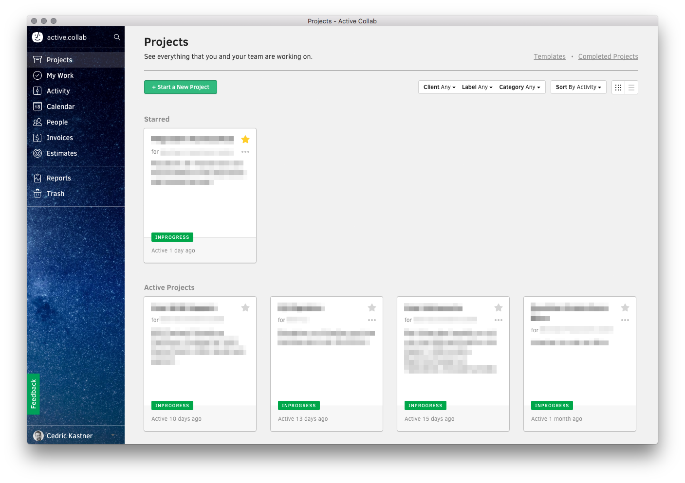

# &nbsp;Active Collab Desktop

> Unofficial [ActiveCollab](https://www.activecollab.com) Desktop application based on [Electron](http://electron.atom.io).

[](https://github.com/nurtext/active-collab-desktop/releases/latest)

*Supported platforms: Mac OS X 10.8+, Windows 7+ & Linux*

## Installation

### Mac OS X

[**Download**](https://github.com/nurtext/active-collab-desktop/releases/latest), unzip, and move `Active Collab Desktop.app` to the `/Applications` directory.

### Windows

[**Download**](https://github.com/nurtext/active-collab-desktop/releases/latest) and unzip to some location.

### Linux

[**Download**](https://github.com/nurtext/active-collab-desktop/releases/latest) and unzip to some location.

To add a shortcut to the app, create a file in `~/.local/share/applications` called `ActiveCollabDesktop.desktop` with the following contents:

```
[Desktop Entry]
Name=Active Collab Desktop
Exec=/full/path/to/folder/active-collab-desktop
Terminal=false
Type=Application
Icon=/full/path/to/folder/active-collab-desktop/resources/app/media/Icon.png
```

## Pointing to a self-hosted installation of Active Collab

Please see the [Wiki](https://github.com/nurtext/active-collab-desktop/wiki) for further information about this topic.

## Development

Built with [Electron](http://electron.atom.io).

###### Commands

- Init: `$ npm install`
- Run: `$ npm start`
- Build OS X: `$ npm run build-osx`
- Build Linux: `$ npm run build-linux`
- Build Windows (32-Bit): `$ npm run build-win32`
- Build Windows (64-Bit): `$ npm run build-win64`
- Build all: `$ brew install wine` and `$ npm run build` *(OS X only)*


## License

MIT © [Cedric Kastner](http://github.com/nurtext)
